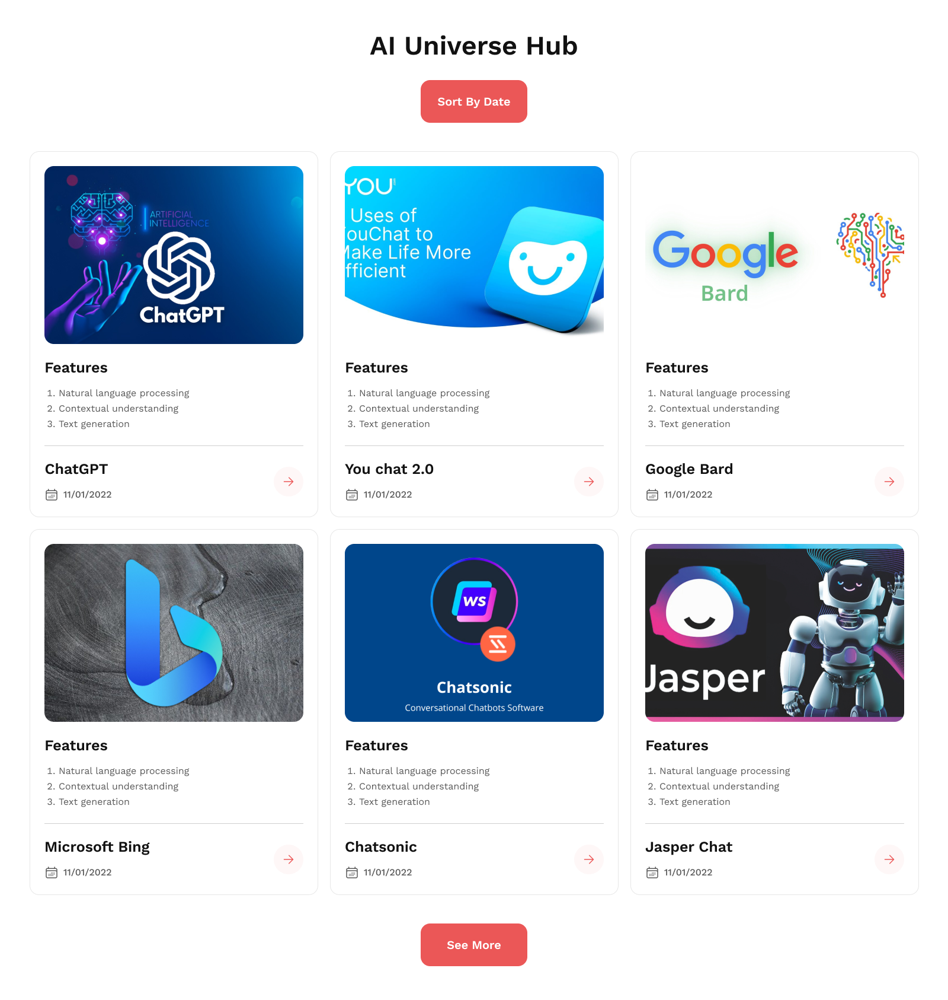
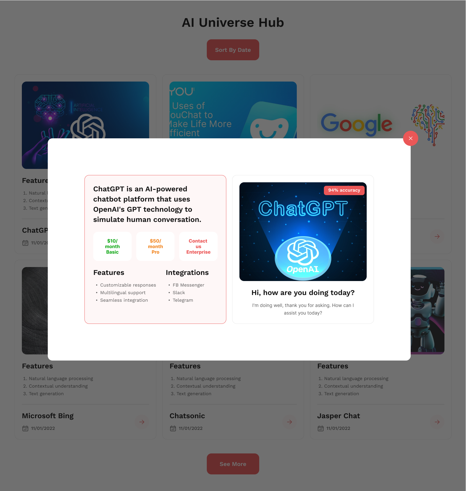

# pghero-assignment6

This project is a clone of the following design

## Learning Outcome
1. DOM
2. Basic JS
3. Bootstrap
4. API integration

## Resource Link
[Click Here](https://github.com/ProgrammingHero1/AI-universe-hub)

## Live Website Link
[Click Here](https://chipper-duckanoo-d30b1e.netlify.app/)

## Helpful Resources
- [Loop through objects keys and values](https://flexiple.com/javascript/loop-through-object-javascript/)
- [Bootstrap Icons](https://www.tutorialrepublic.com/twitter-bootstrap-tutorial/bootstrap-icons.php)
- [Date Parse](https://developer.mozilla.org/en-US/docs/Web/JavaScript/Reference/Global_Objects/Date/parse)
- [Sorting an array](https://www.scaler.com/topics/javascript-sort-an-array-of-objects/)